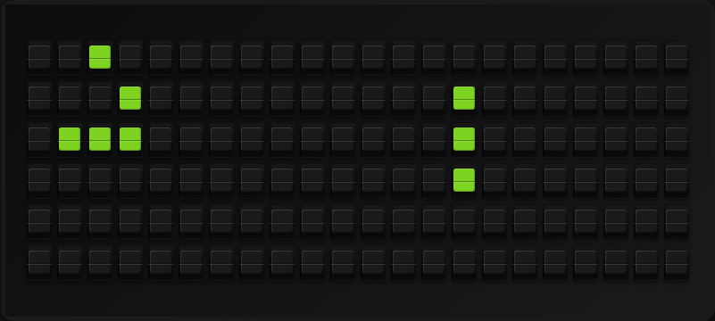

# Game of Life Plugin

Conway's Game of Life, running live on your board. Every refresh advances the
colony one generation: live cells are a colored tile, dead cells are black.
When the colony dies out, settles into a still life or a period-2 oscillator,
or hits the generation cap, the board reseeds itself so it never sits frozen.



No API, no key — the simulation runs entirely on your FiestaBoard.

**→ [Setup Guide](./docs/SETUP.md)** — Configuration instructions

## How It Works

Each `fetch_data` call:

1. Applies the standard B3/S23 rules to every cell. With **Wrap Edges** on
   (the default) the grid is a torus, so gliders that leave one edge re-enter
   on the opposite side.
2. Ages every survivor by one generation (used by the `rainbow` color mode).
3. Renders the grid to board tiles and hashes it.
4. Reseeds if the population hit zero, if the grid has been unchanged or
   oscillating with period 2 for **Reseed After Stable** generations, or if
   **Max Generations** has been reached.

## Boards

The grid is the board. Every dimension is read from the board being rendered
on (`self.board`), so a Flagship runs 6x22, a Note 3x15, and a note array
anything from 3x15 up to 24x120 — which is also what a FiestaPanel is (a
virtual note array sized to a TV: 12x30 for a 65", 18x45 for an 85").

**Each board runs its own colony.** One plugin instance serves every board you
own, so the simulation is kept per board geometry: adding a Note does not
disturb the Flagship's run, and a boardless read of
`GET /plugins/game_of_life/data` is its own colony rather than a poll that
advances a real board behind its back.

## Template Variables

```
{{game_of_life.game_of_life}}        # full board frame (use on line 1 with wrap)
{{game_of_life.generation}}          # generations since the last seed
{{game_of_life.population}}          # live cells
{{game_of_life.board_rows}}          # rows in the simulated grid
{{game_of_life.board_cols}}          # columns in the simulated grid
{{game_of_life.is_stable}}           # true once the grid stops changing
{{game_of_life.seed_pattern}}        # the configured seed pattern
```

`game_of_life_array` is also exposed: the same frame as a 2-D list of board
character codes, for templates or plugins that want the raw tiles.

## Example Template

Full-screen art — put the frame on line 1 with wrapping on and leave the rest
of the lines empty:

```
{{game_of_life.game_of_life}}
```

## Settings

| Setting                | Default  | Description                                                                                     |
| ---------------------- | -------- | ----------------------------------------------------------------------------------------------- |
| `enabled`              | `false`  | Enable the plugin                                                                                 |
| `cell_color`           | `green`  | `red`, `orange`, `yellow`, `green`, `blue`, `violet`, `white`, or `rainbow` (color by cell age)   |
| `wrap_edges`           | `true`   | Treat the board as a torus                                                                        |
| `seed_pattern`         | `random` | `random`, `glider`, `r_pentomino`, `lwss`, or `gliders`                                           |
| `initial_density`      | `0.3`    | Fraction of cells alive in a random seed (0.1–0.6)                                                |
| `reseed_after_stable`  | `3`      | Reseed after this many unchanged / period-2 generations                                           |
| `max_generations`      | `200`    | Reseed after this many generations; `0` = unlimited                                               |
| `refresh_seconds`      | `60`     | Seconds between generations (minimum 10)                                                          |

### Seed Patterns

| Pattern             | Size  | Behaviour                                                      |
| ------------------- | ----- | -------------------------------------------------------------- |
| `random`            | —     | Random fill at `initial_density`; usually the liveliest option  |
| `glider`            | 3x3   | Gliders walking diagonally across the board                     |
| `r_pentomino`       | 3x3   | Classic methuselah — chaotic for a long run                     |
| `lwss`              | 4x5   | Lightweight spaceships travelling sideways                      |
| `pulsar`            | 13x13 | Period-3 oscillator; needs a board at least 13x13               |
| `gosper_glider_gun` | 9x36  | Emits a glider every 30 generations; needs at least 9x36        |
| `gliders`           | 3x3   | Legacy alias for `glider`, kept so old configs keep working     |

Every pattern **tiles to fill the board**: as many copies as fit with a
two-cell gap between them, on both axes, so the seed is as dense on a Note as
on a 24x120 array. The number of copies is the board's decision, never a
constant — a single fixed shape would put 5 live cells in the 2,880 of a max
array and read as a blank board.

A pattern too large for the board in hand is **substituted, never clipped** — a
clipped shape is not the shape (an LWSS missing its bottom row is a 5-cell
fragment that does not travel). So `gosper_glider_gun` falls back to `pulsar`,
then `lwss`, then `glider`, until one fits. That means the big classics are
offered to every board and gated when they are seeded: a 24x120 array has room
for a pulsar and a Gosper gun, and a Note does not.

### Rainbow Mode

With `cell_color` set to `rainbow`, each cell is colored by how long it has
survived: newborns are white, then red, orange, yellow, green, blue, violet,
cycling back to red. Gliders and spaceships stay mostly white (their cells are
constantly reborn), while still lifes drift through the palette.

## Board Noise

Every generation flips a lot of tiles, so the physical board is loud at short
refresh intervals. `refresh_seconds` of 60 or more is a good default; pattern
seeds such as `glider` change far fewer tiles per generation than `random`.

## Author

FiestaBoard Team
